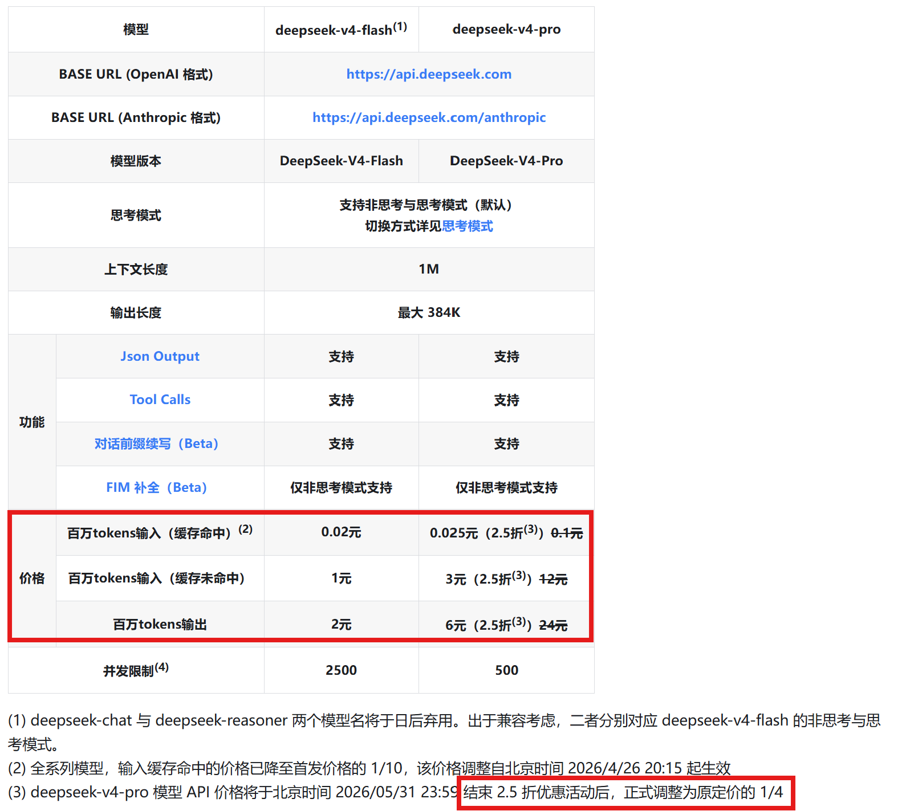

# OpenCode + DeepSeek：学生也能用的 Vibe Coding 自由方案

低成本、高效率的 AI 辅助编程环境搭建教程。

[中文](./README.md) | [English](./README_en.md)

---

## 目录

1. [一、OpenCode — 开源的 AI 编程 Agent](#一opencode--开源的-ai-编程-agent)
2. [二、DeepSeek — 为什么选它](#二deepseek--为什么选它)
3. [三、Skills 推荐 + 配置流程 — 武装你的 Agent](#三skills-推荐--武装你的-agent)

---

## 一、OpenCode — 开源的 AI 编程 Agent

如官网介绍，[OpenCode](https://opencode.ai/) 是一个开源的 AI 编码代理。它提供终端界面、桌面应用和 IDE 扩展等多种使用方式。我个人觉得使用体验非常像 Claude Code，不能像 Cursor 一样在里面自己修改代码，OpenCode Agent + Cursor 人工及时校准项目代码，能有效兼顾人工智能和能工智人，配合一点古法编程还是能对项目有更强的掌控。

**安装：**

去 [OpenCode 下载页](https://opencode.ai/download)，选择适合你操作系统的版本。我用的是 Windows 笔记本，**强烈推荐 OpenCode 桌面版**（红框标出）：

---

## 二、DeepSeek — 为什么选它

### 三个选择理由

**1）对中文指令理解不错，服务稳定**

连续三周重度使用，从未遇到过限流或者长时间不响应。作为对比，Cursor 每到晚上就开始 "taking longer than expected"，响应极度缓慢甚至直接断连。

**2）成本极低**

详见 [DeepSeek API 定价](https://api-docs.deepseek.com/zh-cn/quick_start/pricing/)，2.5 折体验结束之后正式定价也很便宜。编程任务缓存命中率在 98% 左右，百万 token 输入才 $0.02，约等于不要钱。

**3）缺点：没有视觉识别能力**

但是对于编程任务足够用了。我自己主要用 Python/LaTeX 做实验、写论文，基本够。

### 配置步骤

**第 1 步：获取 API Key**

登录 [DeepSeek 开放平台](https://platform.deepseek.com/)，在 [API Keys 页面](https://platform.deepseek.com/api_keys) 创建一个 key，命名后直接复制保存。

**第 2 步：实名认证 & 充值**

身份证实名认证后，在 [用量信息页](https://platform.deepseek.com/usage) 点击充值。

**第 3 步：在 OpenCode 中连接 DeepSeek**

打开下载好的 OpenCode，点击「管理模型」：

**第 4 步：连接提供商**

点击「连接提供商」，搜索找到 DeepSeek，点最右侧的 "+"，输入 API 密钥，提交：

**第 5 步：确认**

DeepSeek 出现在模型列表，思考强度可以调整（我一直用的 Max）：

---

## 三、Skills 推荐 — 武装你的 Agent

Skills 是给 Agent 装上的"外挂模块"，每个 Skill 是一个包含 `SKILL.md` 的目录。Agent 有两种使用方式：

- **自动匹配**：Agent 读到 `SKILL.md` 里的描述，遇到对应任务时自动加载
- **手动指定**：在 OpenCode 对话框输入 `/` 调出 Skill 列表直接选

安装也很省心——几乎所有 Skill 仓库都在 README 或 `SKILL.md` 里附了给 LLM Agent 的安装提示，把链接贴进 OpenCode 对话框，Agent 读完指南会自己一步步搞定。

### 你需要手动做的（GUI，约 5 分钟）

> OpenCode 和 DeepSeek 的安装配置还是得自己来——涉及网页注册、点按钮、填表单这些 GUI 操作，AI 帮不上忙。详见[第二章配图](#二deepseek--为什么选它)。

下面推荐我自己日常高频用的几类。

### 1. 多智能体编排

[oh-my-openagent](https://github.com/code-yeongyu/oh-my-openagent) — 给 OpenCode 装上全套多智能体系统（Sisyphus 编排器 + 11 个专业 Agent + Team Mode）。装好之后只要在 prompt 里带 `ultrawork` 关键词，系统自动协调 Agent 干活，不用自己手动调度。仓库里有完整的安装指南，直接贴给 Agent 执行。

### 2. Superpowers 系列

Superpowers 是 OpenCode 内置的核心工作流技能，影响 Agent 的行为模式（均为 OpenCode 自带，无需额外安装，在 prompt 里提关键词即可触发）：

- **using-superpowers** — 告诉 Agent 怎么自动发现和加载匹配的 Skill
- **brainstorming** — 任何创造性任务之前先做需求澄清和方案设计
- **systematic-debugging** — 遇到 bug 先系统性分析，而不是盲目试错
- **test-driven-development** — TDD 红→绿→重构流程

### 3. [antigravity-awesome-skills](https://github.com/sickn33/antigravity-awesome-skills) — 社区 Skills 大合集

如果说 oh-my-openagent 是大脑，那这个就是兵器库。1,400+ 个社区贡献的 Skills，覆盖你能想到的所有场景。仓库 README 里就有给 Agent 的一键安装提示。

装完你能用到的主要 Skill：

| 分类 | Skill | 干什么用 |
|------|-------|---------|
| **学术科研** | scientific-writing | IMRAD 结构化论文写作，支持 APA/AMA/Vancouver 引用 |
| | paper-lookup | 跨 PubMed / arXiv / bioRxiv / Semantic Scholar 搜论文 |
| | citation-management | Google Scholar 搜引文 + DOI 转 BibTeX |
| | pyzotero | 与 Zotero 文献库联动，程序化管理引用 |
| | scientific-schematics | 科研示意图（神经网络架构图、实验流程图等） |
| | scientific-visualization | 期刊级多面板数据图 |
| | scientific-slides | 学术组会 PPT 制作 |
| | peer-review | 结构化论文/基金审稿 |
| | literature-review | 系统性文献综述 |
| **可视化** | architecture-diagram | 架构图（Mermaid / PlantUML / D2） |
| | markdown-mermaid-writing | 24 种 Mermaid 图写法 |
| | scientific-visualization | 多面板配图 + 期刊格式化 |
| **开发效率** | git-hygiene | 自动清理 git 工作区，防止 diff 爆炸 |
| | test-driven-development | TDD 红→绿→重构 |
| | code-review | 多视角代码审查 |
| **联网搜索** | web-access | 搜索、网页抓取、社交媒体读取 |
| | parallel-web | 学术文献优先的并行搜索 |
| **辅助思考** | brainstorming | 需求澄清 + 方案设计 |
| | scientific-critical-thinking | 论文论证质量评估 |
| | hypothesis-generation | 科学假设生成 |

> 只列了常用的四分之一，完整清单见 [antigravity-awesome-skills](https://github.com/sickn33/antigravity-awesome-skills)。

### 4. 独立仓库推荐

这几个不是合集里的，但值得单独装。同样，去各自仓库 README 里找给 Agent 的安装提示，贴进对话框就行：

- [andrej-karpathy-skills](https://github.com/multica-ai/andrej-karpathy-skills) — Karpathy 编码四原则（先思考、简洁优先、精准修改、目标驱动），一个 `CLAUDE.md` 文件搞定
- [obsidian-skills](https://github.com/kepano/obsidian-skills) — 如果你用 Obsidian 做笔记，Agent 可以直接读写你的 Vault
- [caveman](https://github.com/JuliusBrussee/caveman) — 让 Agent 用"原始人"风格输出，减少 ~75% token 消耗
